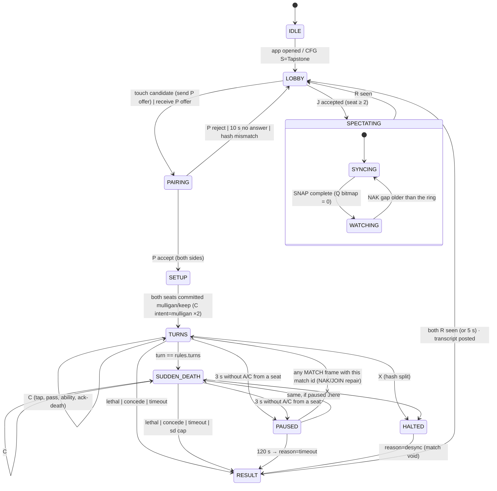

# Tapstone match state machine — DRAFT

Companion to [`tapstone-protocol-draft.md`](tapstone-protocol-draft.md). One machine runs on every
shrine; the arbiter and a follower differ only in which transitions they *initiate*. Frame kinds
are the `SMOLv1 MATCH` letters (`L P T C A N J S Q X R`).

## The machine



ASCII, for the serial console:

```
IDLE → LOBBY → PAIRING → SETUP → TURNS ⇄ PAUSED
                  ↑                 ↓          ↘
                LOBBY ←──── RESULT ← SUDDEN_DEATH ⇄ PAUSED
                               ↑
                             HALTED  (from TURNS / SUDDEN_DEATH on hash split)
```

## States

| state | who commits | screen | timers |
|---|---|---|---|
| IDLE | — | scry idle face | — |
| LOBBY | — | castle face + candidate list (nearest first, greyed with reason) | `L` beacon 2 s |
| PAIRING | — | "Play <name>?" / "Waiting for <name>" | offer expiry 10 s |
| SETUP | arbiter | empty battlefield, coin result, "keep / mulligan" touch | none (physical shuffle) |
| TURNS | arbiter | battlefield, turn owner glow, turn clock | turn clock (rules), `C` head re-broadcast 1 s, `A` heartbeat 1 s |
| SUDDEN_DEATH | arbiter | red phase light, damage doubles (rules) | sd cap (rules) |
| PAUSED | nobody | "link lost" over frozen board | 120 s → timeout |
| HALTED | nobody | "Desync at event n" + both hashes, board at n−1 | — |
| RESULT | — | winner flourish, sigils, transcript posting status | 5 s → LOBBY |
| SPECTATING | — | board (read-only), "syncing…" until snapshot complete | `N`/`Q` on gap |

## Events × states

Rows are received frames or local inputs; cells say the action (— = ignored, ⚠ = logged and dropped).

| event | LOBBY | PAIRING | SETUP / TURNS / SUDDEN_DEATH | PAUSED | HALTED | RESULT |
|---|---|---|---|---|---|---|
| `L` from peer | update candidate (RSSI, hashes) | update | — | — | — | update |
| touch candidate | send `P offer` → PAIRING | — | — | — | — | — |
| `P offer` | ask player | lower `match` wins, other dropped | ⚠ | ⚠ | ⚠ | — |
| `P accept` | — | → SETUP (seat map fixed, arbiter = seat 0) | ⚠ | — | — | — |
| `P reject` / 10 s | — | → LOBBY | — | — | — | — |
| card tap (local) | show "unbound sigil" if not in registry | — | resolve intent → arbiter: validate+`C`; follower: `T` until `C`/reject/2 s | queue locally | — | — |
| touch lane/cell (local) | — | — | completes a pending intent, or `gesture=2` touch-only event | queue | — | — |
| `T` (arbiter only) | ⚠ | ⚠ | validate → `C` or `T sub=1` reject | — | — | — |
| `C mseq=n` | ⚠ | ⚠ | n = head+1: apply, compare hash, `A`; n ≤ head: `A`, drop; n > head+1: `N head+1..n−1` | leave PAUSED, then as TURNS | — | — |
| hash mismatch on apply | — | — | send `X`, → HALTED | — | — | — |
| `X` | — | — | → HALTED | → HALTED | — | — |
| `A` (arbiter only) | — | — | clear retransmit for mseq; note peer hash; mismatch → `X` | leave PAUSED | — | clear retransmit; both seats at the final mseq → LOBBY (arena linger) |
| no `A` after 5 × 200 ms (arbiter) | — | — | → PAUSED | — | — | — |
| no `A`/`C` for 3 s | — | — | → PAUSED | — | — | — |
| `N from to` (arbiter) | — | — | replay ring; older than ring → `S` snapshot | replay | — | replay (arena linger: a lost final commit must still reach the seat) |
| `J` (arbiter) | accept spectator → `S` chunks | — | `S` chunks at head; hold new `C` for the joiner | `S` | — | — |
| `S` chunk | — | — | (spectator/resumer) fill, `Q` bitmap | fill | — | — |
| `Q` (arbiter) | — | — | resend set bits; zero bitmap → release held `C` | resend | — | — |
| turn clock expiry | — | — | `gesture=3` timer event → `C intent=pass` (arbiter) | frozen | — | — |
| turn == rules.turns | — | — | → SUDDEN_DEATH | — | — | — |
| lethal / concede / sd cap | — | — | arbiter `R`, follower `R` → RESULT | — | `R desync` | — |
| 120 s in PAUSED | — | — | — | `R timeout` → RESULT | — | — |
| `R` | — | — | ⚠ unless from arbiter with head mseq | → RESULT | → RESULT | record second signature |
| both `R` or 5 s | — | — | — | — | — | post transcript → LOBBY |

## Turn structure inside TURNS

```
turn t (owner = seat (coin + t) mod 2)
  ├─ START   : mana += rules.mana_per_turn; engine-driven triggers (no taps)
  ├─ MAIN    : taps — summon (intent lane), ability (intent ability), spell (intent target)
  ├─ COMBAT  : engine resolves lanes in order 0..2; deaths → screen asks the owner to ack-death (tap the card again or touch) — cosmetic, never blocks the clock
  └─ END     : intent=pass (touch "pass" or clock expiry) → turn t+1
```

Every phase change is a consequence of a commit, never a frame of its own: the engine derives phase
from `(turn, last intent)`, so both shrines are in the same phase by construction.

## Timers (all local, all derived from rules or protocol constants)

| timer | value | owner | on expiry |
|---|---|---|---|
| `L` beacon | 2 s | every lobby shrine | resend `L` |
| offer expiry | 10 s | offerer | → LOBBY |
| `T` retransmit | 100 ms, until `C`/reject, cap 2 s | follower | → PAUSED |
| `C` retransmit | 200 ms × 5 | arbiter | seat lost → PAUSED |
| head re-broadcast / `A` heartbeat | 1 s | arbiter / follower | resend |
| stale peer | 3 s | both | → PAUSED |
| pause timeout | 120 s | both | `R timeout` |
| turn clock | `rules.turn_s` (default 60) | both, from mesh clock seconds | arbiter commits `pass` |
| sudden death cap | `rules.sd_turns` (default 3) | both | `R sd` — higher life wins, tie = seat with initiative loses |
| result linger | 5 s, or both seats acked the final mseq | both; the arena keeps retransmitting unacked commits (200 ms), answers `N`, and re-broadcasts the head `C` and `R` every 1 s | → LOBBY |
